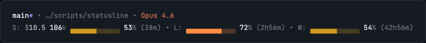

# Claude Code Statusline

[](https://www.npmjs.com/package/@mingrath/claude-code-statusline)
[](https://opensource.org/licenses/MIT)

Custom statusline for Claude Code that shows real-time rate limit usage percentages with progress bars.



**What you see:**
- **Line 1:** Git branch + path + model name
- **Line 2:** `S:` Session (cost, tokens, context %) `L:` 5-hour rate limit % `W:` Weekly all-models limit %

## Quick Start

### Option A: npm install (recommended)

```bash
npm i -g @mingrath/claude-code-statusline
```

Add to `~/.claude/settings.json`:

```json
{
  "statusLine": {
    "type": "command",
    "command": "bun -e \"import '@mingrath/claude-code-statusline'\"",
    "padding": 0
  }
}
```

### Option B: Clone manually

```bash
git clone https://github.com/mingrath/claude-code-statusline.git ~/.claude/scripts/statusline
cd ~/.claude/scripts/statusline && bun install
cp statusline.config.example.json statusline.config.json
```

Add to `~/.claude/settings.json`:

```json
{
  "statusLine": {
    "type": "command",
    "command": "bun ~/.claude/scripts/statusline/src/index.ts",
    "padding": 0
  }
}
```

## Features

- Git branch with dirty indicator and staged/unstaged counts
- Session cost ($) and duration
- Context tokens used with progress bar (% of 200k window)
- **5-hour rate limit utilization %** with reset countdown (from Claude API)
- **Weekly all-models limit %** with reset countdown (from Claude API)
- Configurable progress bar styles (braille, filled, rectangle)
- Progressive color coding (gray < 50%, yellow < 70%, orange < 90%, red 90%+)

## How It Works

The statusline fetches real utilization percentages from Claude's OAuth API using the same authentication as Claude Code itself. The key is the `anthropic-beta: oauth-2025-04-20` header.

Data flow:
```
Claude Code Hook (stdin JSON) --> index.ts
                                    |
                    +---------------+---------------+
                    |               |               |
              [Git Status]   [Context Data]   [Usage Limits API]
                    |               |               |
                    +-------+-------+-------+-------+
                            |
                    [Render Statusline]
                            |
                        stdout
```

## Configuration

Edit `statusline.config.json` to customize:

| Section | Options |
|---------|---------|
| **session** | cost, duration, tokens, context % with progress bar |
| **limits** | 5-hour utilization %, progress bar, reset countdown |
| **weeklyUsage** | Weekly utilization %, progress bar, reset countdown |
| **git** | branch, dirty indicator, staged/unstaged counts |

### Progress Bar Styles

```
braille:    ⣿⣿⣿⣿⣿⣤⣀⣀⣀⣀
filled:     ████████░░░░░░░
rectangle:  ▰▰▰▰▰▰▱▱▱▱
```

### Color Modes

- `progressive` - Changes color based on usage (gray → yellow → orange → red)
- `green`, `yellow`, `red`, `peach` - Fixed color

## Project Structure

```
src/
├── index.ts              # Main entry - orchestrates data + render
└── lib/
    ├── config-types.ts   # TypeScript config interfaces
    ├── config.ts         # Config loader
    ├── context.ts        # Context token calculation
    ├── features/
    │   └── limits.ts     # OAuth API usage limits fetcher
    ├── formatters.ts     # Colors, progress bars, formatting
    ├── git.ts            # Git branch + changes
    ├── render-pure.ts    # Pure renderer (data + config → string)
    └── types.ts          # Hook input types
```

## Requirements

- [Bun](https://bun.sh/) runtime
- Claude Code with OAuth authentication (subscription plan)
- macOS (uses Keychain for OAuth token) or Linux (~/.claude/.credentials.json)

## Development

```bash
bun install
bun run test
bun run lint
```

## Related

- **[claude-code-notify](https://github.com/mingrath/claude-code-notify)** — Get push notifications on Mac, iPhone, and Apple Watch when Claude Code needs your input. Uses terminal-notifier + ntfy.sh. Great companion for autonomous "walk away" sessions.

## License

MIT
